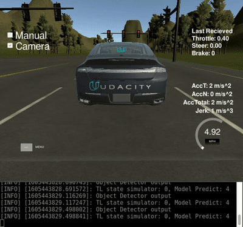

# Udacity-CarND-Capstone


This is the project repo for the final project of the Udacity Self-Driving Car Nanodegree: Programming a Real Self-Driving Car. 
The goal of the project is  to implement core functionality of the autonomous vehicle system, including traffic light detection,  
control, and waypoint following

# Individual Submission

Name 				     | Udacity Account Email
---------------- | ---------------------
Kuan-Hsun Chen   | blackshield33@gmail.com

## Running the Code

1. Clone this repo

2. Install python dependencies
```bash
cd CarND-Capstone
pip install -r requirements.txt
```
3. Make and run styx
```bash
cd ros
catkin_make
source devel/setup.sh
roslaunch launch/styx.launch
```
4. Run the [simulator](https://github.com/udacity/CarND-Capstone/releases)

## Artchitecture 


## Waypoint Updater
The  purpose of this node is to publish a fixed number of waypoints ahead of the vehicle with the correct target velocities, depending on traffic lights and obstacles.

## Drive By Wire / Twist Controller
Once waypoint updater publishes messages to /final_waypoints, the vehicle's waypoint follower will publish twist commands to the /twist_cmd topic. The goal for this  part of the project is to implement the drive-by-wire node (dbw_node.py) which will subscribe to /twist_cmd and use various controllers to provide appropriate throttle, brake, and steering commands. 

## Traffic Light Detector
Once the vehicle is able to process waypoints, generate steering and throttle commands, and traverse the course, it will also need stop for obstacles. Traffic lights  are the first obstacle that we'll focus on.

Traffic light classifier(tl_classifier.py) takes in images from on board camera, images are process by a pretrained MobileNet SSD model for object detect.
Objects classified as traffic light (class==10) will go through an simple HSV filter for red light detecction.  



## Dependencies

* Be sure that your workstation is running Ubuntu 16.04 Xenial Xerus or Ubuntu 14.04 Trusty Tahir. [Ubuntu downloads can be found here](https://www.ubuntu.com/download/desktop).
* If using a Virtual Machine to install Ubuntu, use the following configuration as minimum:
  * 2 CPU
  * 2 GB system memory
  * 25 GB of free hard drive space

  The Udacity provided virtual machine has ROS and Dataspeed DBW already installed, so you can skip the next two steps if you are using this.

* Follow these instructions to install ROS
  * [ROS Kinetic](http://wiki.ros.org/kinetic/Installation/Ubuntu) if you have Ubuntu 16.04.
  * [ROS Indigo](http://wiki.ros.org/indigo/Installation/Ubuntu) if you have Ubuntu 14.04.
* Download the [Udacity Simulator](https://github.com/udacity/CarND-Capstone/releases).

### Docker Installation
[Install Docker](https://docs.docker.com/engine/installation/)

Build the docker container
```bash
docker build . -t capstone
```

Run the docker file
```bash
docker run -p 4567:4567 -v $PWD:/capstone -v /tmp/log:/root/.ros/ --rm -it capstone
```

### Port Forwarding
To set up port forwarding, please refer to the "uWebSocketIO Starter Guide" found in the classroom (see Extended Kalman Filter Project lesson).

### Usage

1. Clone the project repository
```bash
git clone https://github.com/udacity/CarND-Capstone.git
```

2. Install python dependencies
```bash
cd CarND-Capstone
pip install -r requirements.txt
```
3. Make and run styx
```bash
cd ros
catkin_make
source devel/setup.sh
roslaunch launch/styx.launch
```
4. Run the simulator


